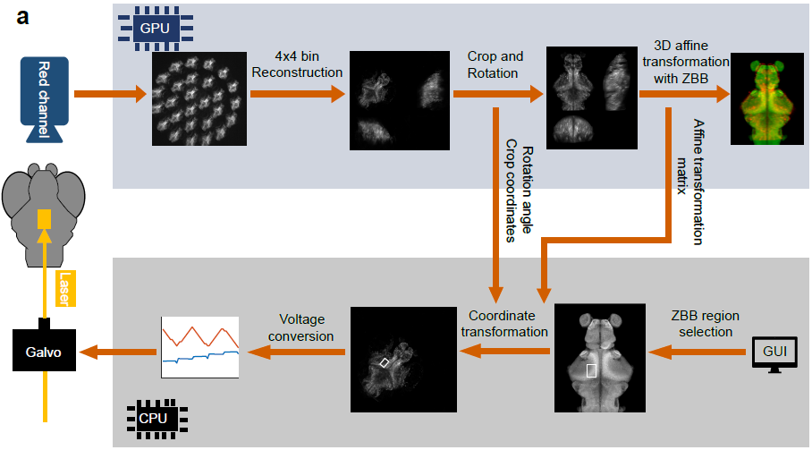

# Online-Zebrafish-Optogenetics-System

Source code of online optogenetic system in  "[*All-optical interrogation of brain-wide activity in freely swimming larval zebrafish*](https://www.biorxiv.org/content/10.1101/2023.05.24.542114v1)"

## Introduction

We achieved the optogenetic system that enables real-time manipulation of user-defined brain regions in freely behaving larval zebrafish. 
A user first selects the region to be stimulated on the zebrafish brain browser (ZBB) atlas. 
The system then translates the region into actual locations on the fish brain and delivers photo-stimulation through real-time image processing and coordinate transformation. 
Optogenetic system was built up in C++ and CUDA.   

The working code is in [optogenetic-src](10-optogenetic-src).
Code for organizing dataset and training affine network is in [affine-network](02-affine-CNNnetwork).
Code for generating Galvo voltage matrix is in [initialization](00-initialization).

## Pipeline

After the images were captured by the red fluorescence camera, the image reconstruction and alignment process were implemented in the GPU, while the coordinate transformation and the control of the galvo were implemented in the CPU. 

 Image reconstruction and registration 

We resized an image from 2048 * 2048 pixels to 512 * 512 pixels using the [https://github.com/avaneev/avir] (AVIR image resizing algorithm designed by Aleksey Vaneev).
  Due to the reduced image size and memory consumption, we could use the PSF of the whole volume to do the deconvolution with a total of 10 iterations.
  We used TCP to communicate between the tracking system and the optogenetic system.   
  
  We rotated the fish head orientation of the 3D image to match that of the ZBB atlas using the fish heading angle provided by the tracking system. 
  We then found the maximum connected region by threshold segmentation and removed the redundant pixels outside the region.
  The size of the image after cropping was 95 * 76 * 50 pixels, which is the same as the ZBB atlas. 
  Finally, we aligned the 3D image with the standard brain by affine transformation using a transformer neural network model. 

 Coordinate transformation 

  The coordinate transformation first calculated the inverse of the affine matrix and the rotation matrix. 
  The user-provided coordinates of the region on the ZBB atlas were then multiplied by the transformation matrix. 
  Finally, the transformed coordinates were shifted by the upper left corner coordinates of the cropped image. 
  This converted the coordinates of the specified region selected in the ZBB atlas to the coordinates of the actual fish brain.
  
  

  
  
  

 Galvo control 

  The voltage pairs to be applied to Galvo were read from the GalvoX and GalvoY voltage matrices. 
  The voltage signals were then delivered to the 2D galvo system using an I/O Device. 
  The galvo system converted the voltage signals into angular displacements of two mirrors, allowing rapid scanning of a specified area.
  
  

  
  
  
  ## Hardware
  - 2D galvo system (Thorlabs GVS002, US)
  - I/O Device (National Instruments PCIe-6321, US)
  - sCMOS cameras (Andor Zyla 4.2, UK)
  - 588 nm laser (CNI MGL-III-588, China)
  - NVIDIA GeForce RTX 3080ti

  ## Dependency
  - CUDA 11.1
  - CUDNN 8.2.0
  - OpenCV 4.55
  - pytorch 1.9.1
  - Libtorch 1.9.1
  - eigen 3.4.0
  - gdal 2.3.2
  - [*avir*](https://github.com/avaneev/avir)
  - NIDAQ C

## Contributors
- [Kexin Qi](https://github.com/kexin2016) (`kexinqi@mail.ustc.edu.cn`)
- [Chen Shen](https://github.com/Distagon-T)(`cshen@ustc.edu.cn`)
- [Quan Wen](https://github.com/wenquan) (`qwen@ustc.edu.cn`)

  
